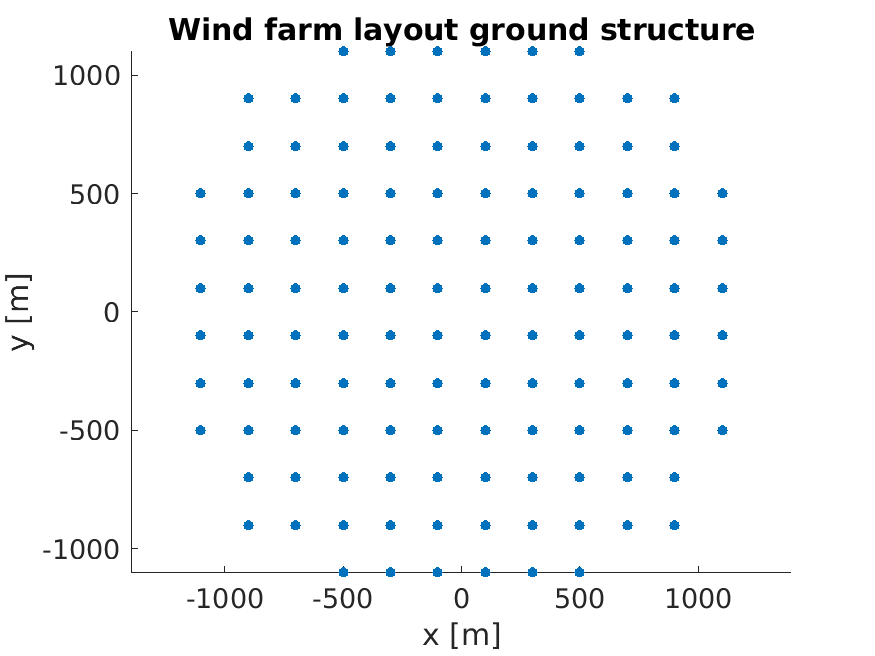
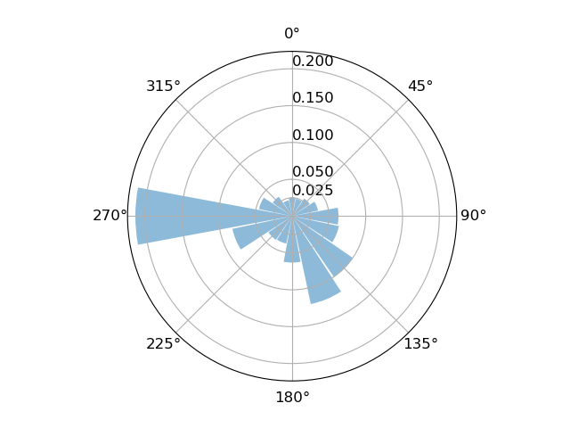
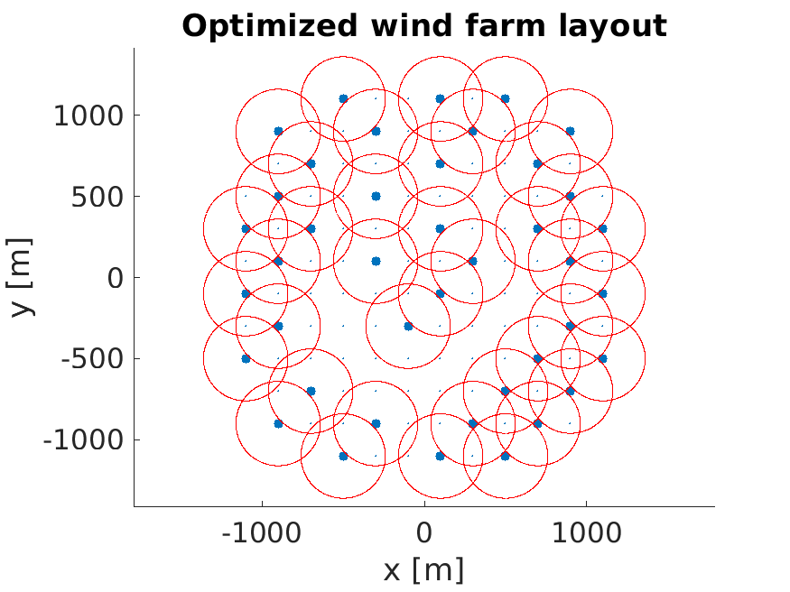
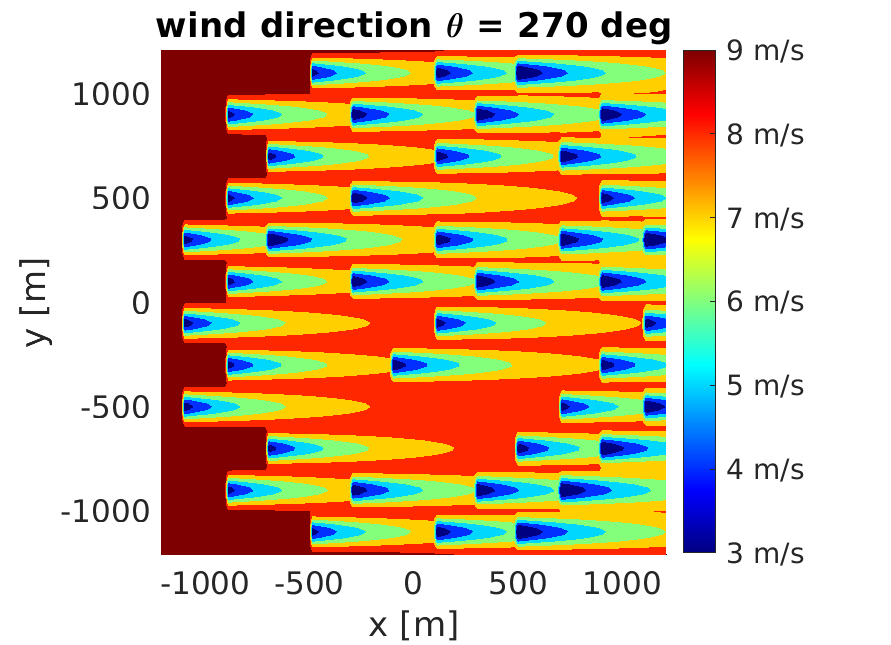

# Topology Optimization of Wind Farm Layouts   

MATLAB code for topology optimization of wind farm layouts, with a sequential linear programming (SLP) approach.   

The code implements the optimization approach proposed in: [Pollini, N. (2022). Topology optimization of wind farm layouts. Renewable Energy, 195, 1015-1027](https://www.sciencedirect.com/science/article/pii/S0960148122008503).   

         
### Example

Initial grid of wind turbines. There are 124 potential wind turbine. During the optimization analysis, a minimum of 16 and a maximum of 64 wind turbines are allowed to be placed.   
    
   

Wind rose, for a wind speed of 9.8 m/s.   
 

Optimized wind farm layout.   
The red circles define the minimum distance between wind turbines.
    
  

